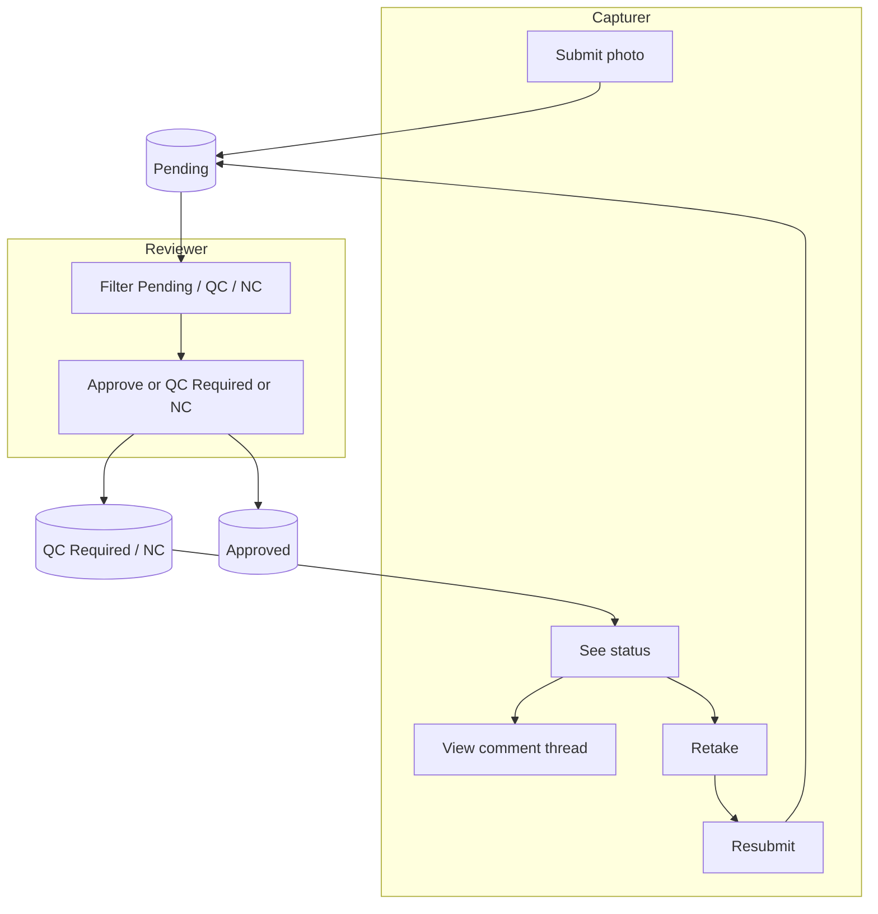
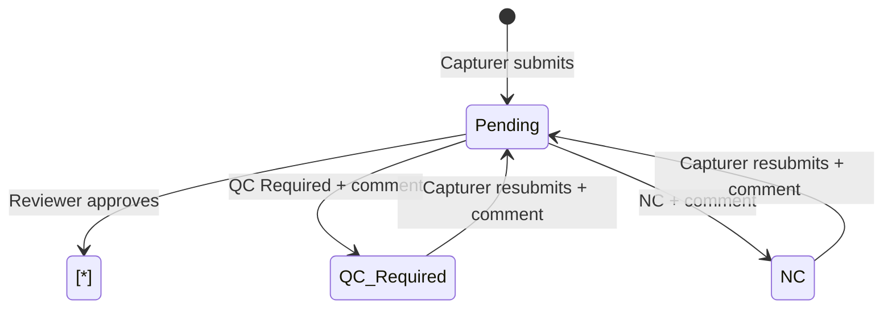

# Photo Review Workflow: Approve / QC Required / NC

Review flow for photo submissions. Use for alignment with leads.

---

## Flow (at a glance)

1. **Capturer submits photo** → Status: **Pending**
2. **Reviewer** (Review page) filters by Pending / QC Required / NC and chooses per photo:

| Action         | Comment   | Result        |
|----------------|-----------|---------------|
| **Approve**    | Optional  | **Approved** (done) |
| **QC Required** | Required | **QC Required**    |
| **NC**         | Required | **NC**             |

3. **If QC Required or NC:** Capturer sees orange status and comment icon; can view/add comments. To resubmit: **Retake** → "Comment required" modal → enter comment → **Continue to camera** → take photo → resubmit (new image + comment) → Status back to **Pending**.
4. Repeat until **Approved**.

**Status lifecycle:** `Pending` → (Approve) → **Approved**; or (QC Required/NC + comment) → **QC Required** / **NC** → (capturer resubmits + comment) → **Pending**.

---

## Rules summary

| Rule        | Description |
|------------|-------------|
| **Approve** | Optional comment; status → Approved. |
| **QC Required** | Comment required; capturer must add comment before resubmitting. |
| **NC** | Same as QC Required. |
| **Resubmit** | Only for QC/NC; comment required in modal; same row updated; status → Pending. |
| **Comments** | Stored in thread; reviewer and capturer can view and add. |
| **Bulk** | Approve / QC Required / NC; QC/NC require one shared comment. |

---

## Mermaid diagrams

### High-level flow

### Status lifecycle

---

*For full diagrams (reviewer actions, capturer flow) see the PNG or edit this file.*
